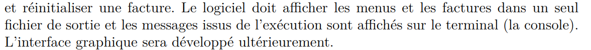

Hello, il y a une extension dans vscode pour UMLet. Le document .uxf.

# UML
## 1. Singleton:
    Facture(Vert)
    Menu, puisqu'il y a seulement un menu
## 2. Factory:
    
## 3. Observer:
    //Facture Subscribe a plat choisi. (Magenta)
    Chef avec facture
## 4. State:
    FactureEtat(Orange)
    Ingredient(Orange) Lui ca serait preferable de le mettre en state?
## 5. MVC:
    Ca pourrait etre pour la facture, a cause du generateFacture.(Vert)
    Et le menu
    

# Classe
## - Menu
- Ajouter plats au menu avec code, description ou prix
- Afficher menu complet, et les attributs